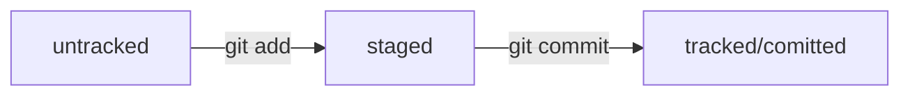

# Оглавление
1. [Git команды](#git-команды)
    - [Инициализация и связь с удалённым репозиторием](#инициализация-и-связь-с-удалённым-репозиторием)
    - [Работа с изменениями и статусом](#работа-с-изменениями-и-статусом)
    - [Коммиты и их изменения](#коммиты-и-их-изменения)
    - [Отправка и просмотр истории](#отправка-и-просмотр-истории)
    - [Откат изменений и сравнение версий](#откат-изменений-и-сравнение-версий)
    - [Управление ветками](#управление-ветками)
2. [.gitignore](#gitignore)
    - [Звёздочка (`*`)](#звёздочка)
    - [Вопросительный знак (`?`)](#вопросительный-знак)
    - [Квадратные скобки (`[…]`)](#квадратные-скобки)
    - [Слеш (`/`)](#слеш)
    - [Парные звёздочки (`**`)](#парные-звёздочки)
    - [Восклицательный знак (`!`)](#восклицательный-знак)
3. [Что такое Hash](#что-такое-hash)
4. [Что такое Fork](#что-такое-fork)
5. [Что такое Pull request](#что-такое-pull-request)
6. [Файл HEAD](#файл-head)
7. [Отслеживание файлов](#отслеживание-файлов)
    - [Статусы файлов](#статусы-файлов)
    - [Типичный жизненный цикл файла в Git](#типичный-жизненный-цикл-файла-в-git)
8. [Workflow](#workflow)
    - [Feature branch workflow](#feature-branch-workflow)
    - [Git flow](#git-flow)
    - [Trunk-based](#trunk-based)
9. [Zsh: Основные команды](#zsh-основные-команды)
    - [Навигация](#навигация)
    - [Создание](#создание)
    - [Копирование и перемещение](#копирование-и-перемещение)
    - [Удаление](#удаление)
10. [Zsh: Hot-keys](#zsh-hot-keys)
---
# Git команды
## Инициализация и связь с удалённым репозиторием
- `git init` – сделать папку репозиторием.
- `rm -rf .git` - «разгитить» папку, если что-то пошло не так.
- `git remote add origin <SSH>/<URL>` - привязать локальный репозиторий к удалённому с `SSH`/`URL`.
- `git remote -v` - проверить, что репозитории связались.
- `git clone <SSH>/<HTTPS>` - клонировать репозиторий. Автоматически связывает локальный репозиторий с удалённым

## Работа с изменениями и статусом
- `git status` – проверить состояние репозитория.
- `git status --ignored` - отобразить все игнорируемые файлы.
- `git add <файл>` – подготовка файла к коммиту.
- `git add --all` – подготовка к коммиту сразу всех файлов, в которых были изменения, и все новые файлы.
- `git add .` – подготовь к коммиту текущую папку и все файлы в ней.
- `git restore --staged <file>` - убрать файл из списка "готовы к коммиту".
- `git restore --staged .` - «сбросить» все файлы из `staged` обратно в `untracked`/`modified`.
- `git restore <file>` - «откатить» изменения к последней версии, которая была сохранена через `git commit` или `git add`

## Коммиты и их изменения
- `git commit -m "текст коммита"` - сделать коммит с ключом `-m`, который присваивает коммиту сообщение.
- `git commit --amend` - внести правки в последний коммит (`HEAD`) вручную.
- `git commit --amend --no-edit` - дополнить коммит новыми файлами.
- `git commit --amend -m "Новое сообщение"` - изменить сообщение коммита.

## Отправка и просмотр истории
- `git push` - отправить изменения на удалённый репозиторий.
- `git push -u origin main` - в первый раз загрузи передать все коммиты из локального репозитория в удалённый с названием `origin`.
- `git log` - посмотреть историю коммитов.
- `git log --oneline` - посмотреть историю коммитов без лишней табуляции.
- `git pull` - подтянуть изменения из удалённого репозитория в локальный.

## Откат изменений и сравнение версий
- `git reset --hard <commit hash>` - «откатиться» до определенного коммита. Более поздние коммиты потеряются.
- `git diff` - сравнить последнюю закоммиченную версию файла с текущей.
- `git diff --staged` - просмотреть изменения в `staged`.
- `git diff <hash_A> <hash_B>` - показать разницу между коммитами с хешами A и B.
- `git diff <название_ветки1> <название_ветки2>` - сравнить ветки
- `git diff commit~ commit` - суффикс навигации `~N`, где `N` — это число. Он отсчитывает от заданного коммита `N` коммитов назад во времени. Нумерация начинается с нуля: `commit~0` — это сам коммит, `commit~1` — предыдущий, `commit~2` — предшествующий предыдущему и так далее.

## Управление ветками
- `git branch` - просмотреть ветки проекта
- `git branch <название_ветки>` - создать ветку
- `git branch -a` - показать все известные ветки, как локальные (в локальном репозитории), так и удалённые (в origin, или на GitHub).
- `git branch -D <название_ветки>` - удалить ветку после объединения
- `git checkout <название_ветки>` - переключиться на другую ветку
- `git checkout -b <название_ветки>` - добавить ветку и сразу переключиться на нее
- `git merge <название_ветки>` - выполнить слияние веток

# .gitignore
С точки зрения Git `.gitignore` — это обычный текстовый файл. Его добавляют в корень репозитория и тоже коммитят.

В простейшем случае в `.gitignore` указывают все файлы, которые нужно игнорировать (по одному имени на строку). Но часто удобнее использовать шаблоны. Шаблон, или правило, — это способ указать сразу на несколько файлов с однотипными названиями.

Правила из `.gitignore` применяются только к новым (`untracked`) файлам. Если файл уже попал в staging area или в коммит, то правила на него не распространяются.

## Звёздочка (`*`)
Символ звёздочки (`*`) соответствует любой строке, включая пустую. Если такой символ используется в шаблоне в `.gitignore`, значит, файл будет проигнорирован вне зависимости от того, что будет на месте звёздочки.

```
# игнорировать все файлы, которые заканчиваются на .jpeg
*.jpeg

# игнорировать все файлы "tmp" во всех подпапках папки docs
docs/*/tmp 
```

## Вопросительный знак (`?`)
Вопросительный знак `?` соответствует одному любому символу.

```
file?.txt 
```

Если сохранить такую запись в `.gitignore`, то будут проигнорированы, например, файлы `fileA.txt` и `file1.txt`. А вот файл `file12.txt` не будет проигнорирован, потому что в его названии два символа после `file`, а не один.

## Квадратные скобки (`[…]`)
Квадратные скобки, как и вопросительный знак, соответствуют одному символу. При этом символ не любой, а только из списка, который указан в скобках.

```
# игнорировать файлы file0.txt, file1.txt и file2.txt
# при этом не игнорировать file3.txt, file4.txt, ...
file[0-2].txt 
```

В скобках можно либо перечислить символы (`[abc]`), либо задать диапазон (`[a-z]`).

## Слеш (`/`)
Слеш (`/`), указывает на каталоги. Если шаблон в `.gitignore` начинается со слеша, то Git проигнорирует файлы или каталоги только в корневой директории.

```
# игнорировать todo.txt в корне репозитория
/todo.txt

# для сравнения: spam.txt будет игнорироваться во всех папках
spam.txt 
```

Если шаблон заканчивается слешем, то правило применится только к папке.

```
# игнорировать папку build
build/ 
```

## Парные звёздочки (`**`)
Функция парных звёздочек (`**`) похожа на функцию одинарной (`*`). Отличие в том, как они работают с вложенными папками. Двойная звёздочка может соответствовать любому количеству таких папок (в том числе нулю). Одинарная может соответствовать только одной.

```
# игнорировать файлы "docs/current/tmp", "docs/old/tmp",
# а также "docs/old/saved/a/b/c/d/tmp"
# и даже "docs/tmp", потому что ноль вложенных папок тоже подходит
docs/**/tmp

# игнорировать только "docs/current/tmp" и "docs/old/tmp"
# файл "docs/old/saved/a/b/c/d/tmp" не попадает в правило
docs/*/tmp 
```

## Восклицательный знак (`!`)
Любое правило в файле `.gitignore` можно инвертировать с помощью восклицательного знака (`!`).

```
# игнорировать все JPEG-файлы
*.jpeg

# но только не мем с Doge
!doge.jpeg 
```

# Что такое Hash
Хеширование (от англ. hash, «рубить», «крошить», «мешанина») — это способ преобразовать набор данных и получить их «отпечаток» (англ. fingerprint).

Информация о коммите — это набор данных: когда был сделан коммит, содержимое файлов в репозитории на момент коммита и ссылка на предыдущий, или родительский (англ. parent), коммит.

Git хеширует (преобразует) информацию о коммите с помощью алгоритма SHA-1 (от англ. Secure Hash Algorithm — «безопасный алгоритм хеширования») и получает для каждого коммита свой уникальный хеш — результат хеширования.

Git хранит таблицу соответствий хеш → информация о коммите. Если вы знаете хеш, вы можете узнать всё остальное: автора и дату коммита и содержимое закоммиченных файлов. Можно сказать, что хеш — основной идентификатор коммита.

# Что такое Fork
«Форк» создаёт копию репозитория в аккаунте GitHub. Такая копия будет полностью независима. Изменения, которые вы внесёте, не будут синхронизированы с исходным репозиторием.

В процессе «форка» создаётся копия всех файлов, истории коммитов и веток. Эта копия сохраняется в вашей учётной записи GitHub.

# Что такое Pull request
Pull request (англ. «запрос на изменения») — это запрос на рассмотрение предлагаемых изменений и часть процесса ревью.

Запрос на изменения можно инициировать двумя способами: через ссылку, которую Git выводит после создания ветки, или через интерфейс GitHub.

После создания пул-реквеста ваши коллеги сделают ревью — оценят предложенные вами правки и оставят свои комментарии.

По результатам ревью ваши правки могут быть приняты в основную ветку проекта или возвращены на доработку.

# Файл HEAD
Файл `HEAD` (англ. «голова», «головной») — один из служебных файлов папки `.git`. Он указывает на коммит, который сделан последним (то есть на самый новый).

Когда вы делаете коммит, Git обновляет refs/heads/master — записывает в него хеш последнего коммита. Получается, что `HEAD` тоже обновляется, так как ссылается на refs/heads/master.

Если нужно передать последний коммит, то вместо его хеша можно просто написать слово `HEAD` — Git поймёт, что вы имели в виду последний коммит.

# Отслеживание файлов


## Статусы файлов
- `untracked`/`tracked` (англ. «неотслеживаемый»)
- `staged` (англ. «подготовленный»)
- `modified` (англ. «изменённый»)

## Типичный жизненный цикл файла в Git
1. Файл только что создали. Git ещё не отслеживает содержимое этого файла. Состояние: `untracked`.
2. Файл добавили в staging area с помощью `git add`. Состояние: `staged` (+ `tracked`). 
    - Возможно, изменили файл ещё раз. Состояния: `staged`, `modified` (+ `tracked`). 
    Обратите внимание: `staged` и `modified` у одного файла, но у разных его версий.
    - Ещё раз выполнили `git add`. Состояние: `staged` (+ `tracked`).
3. Сделали коммит с помощью `git commit`. Состояние: `tracked`.
4. Изменили файл. Состояние: `modified` (+ `tracked`).
5. Снова добавили в staging area с помощью `git add`. Состояния: `staged` (+ `tracked`).
6. Сделали коммит. Состояния: `tracked`.



# Workflow
## Feature branch workflow
### Основные правила
- **Индивидуальные ветки для каждой задачи:** Отдельная ветка для каждой новой функциональности или исправления.
- **Независимая разработка:** Работа ведётся в этих ветках без влияния на основную (main/master).
- **Регулярное обновление веток:** Ветки обновляются от основной, чтобы избежать конфликтов.
- **Код-ревью перед слиянием:** Проверка кода перед слиянием с основной веткой.
- **Слияние после одобрения:** Ветка вливается в основную только после проверки.
- **Удаление ветки после слияния:** Очистка репозитория от ненужных веток.

### Преимущества
1. **Организация:** Чёткое разделение задач и кода.
2. **Параллельная разработка:** Несколько задач разрабатываются одновременно.
3. **Удобство отслеживания:** Легкость в идентификации изменений по задачам.
4. **Снижение рисков:** Меньше ошибок в основной ветке.
5. **Эффективное код-ревью:** Фокус на изменениях по одной задаче.
6. **Гибкость выпусков:** Легче управлять функциональностями в релизах.

## Git flow
### Основные правила
#### Основные ветки
- **`master`:** Ветка, содержащая стабильную версию кода, готовую к релизу.
- **`develop`:** Ветка для разработки, собирающая все новые функции и изменения.

#### Вспомогательные ветки
- **Feature branches (`feature/`)**: Для разработки новых функций, отводятся от `develop` и сливаются обратно в `develop`.
- **Release branches (`release/`)**: Для подготовки к релизу, включая исправление ошибок и документацию. Создаются от `develop` и сливаются в `master` и `develop`.
- **Hotfix branches (`hotfix/`)**: Для срочных исправлений в релизной версии. Отводятся от `master` и сливаются в `master` и `develop`.

### Преимущества
1. **Структурированность**: Чёткая структура и правила для ветвления и слияний.
2. **Поддержка параллельной разработки**: Можно разрабатывать несколько функций одновременно.
3. **Поддержка регулярных релизов**: Удобно управлять циклами релизов и горячих исправлений.
4. **Чёткое разделение стадий разработки**: Отдельные ветки для разработки, подготовки к релизу и срочных исправлений.
5. **Упрощение совместной работы**: Понятная схема ветвления облегчает совместную работу в команде.

**Git Flow** особенно полезен в больших проектах с регулярными релизами и строгими требованиями к управлению версиями.

## Trunk-based
### Основные правила
#### Центральная ветка
- **Одна главная ветка**: Все изменения производятся в главной ветке (`main` или `trunk`), которая содержит последнюю рабочую версию.

#### Короткоживущие ветки
- **Feature branches**: Если используются, то они должны быть короткоживущими (живут не более двух дней) и часто сливаются обратно в главную ветку.

#### Частые коммиты
- **Регулярные и частые коммиты**: Разработчики регулярно делают коммиты в главную ветку, поддерживая тем самым непрерывное интегрирование кода.

#### Непрерывная интеграция
- **CI/CD**: Непрерывная интеграция и доставка (CI/CD) являются ключевыми компонентами, обеспечивающими постоянную готовность продукта к релизу.

### Преимущества
1. **Уменьшение конфликтов слияния**: Частое слияние уменьшает риски сложных конфликтов.
2. **Быстрая обратная связь**: Непрерывная интеграция позволяет быстро находить и исправлять ошибки.
3. **Простота управления**: Отсутствие множества долгосрочных веток упрощает управление.
4. **Скорость разработки**: Минимизация задержек связанных с слиянием и интеграцией.
5. **Повышение качества**: Регулярные ревью кода и тестирование в главной ветке способствуют повышению качества.

# Zsh: Основные команды
## Навигация
- `pwd` (от англ. print working directory, «показать рабочую папку») — покажи, в какой я папке
- `ls` (от англ. list directory contents, «отобразить содержимое директории») — покажи файлы и папки в текущей папке
- `ls -a` — покажи также скрытые файлы и папки, названия которых начинаются с символа
- `cd first-project` (от англ. change directory, «сменить директорию») — перейди в папку first-project
- `cd first-project/html` — перейди в папку html, которая находится в папке first-project
- `cd ..` — перейди на уровень выше, в родительскую папку
- `cd ~` — перейди в домашнюю директорию (/Users/Username)
- `cd /` — перейди в корневую директорию

## Создание
- `touch index.html` (англ. touch, «коснуться») — создай файл index.html в текущей папке;
- `touch index.html style.css script.js` — если нужно создать сразу несколько файлов, можно напечатать их имена в одну строку через пробел;
mkdir second-project (от англ. make directory, «создать директорию») — создай папку с именем second-project в текущей папке.
- `take` - создание новой директории и сразу же заход в нее

## Копирование и перемещение
- `cp file.txt ~/my-dir` (от англ. copy, «копировать») — скопируй файл в другое место;
- `mv file.txt ~/my-dir` (от англ. move, «переместить») — перемести файл или папку в другое место.
Чтение
- `cat file.txt` (от англ. concatenate and print, «объединить и распечатать») — распечатай содержимое текстового файла file.txt.

## Удаление
- `rm about.html` (от англ. remove, «удалить») — удали файл about.html;
- `rmdir images` (от англ. remove directory, «удалить директорию») — удали папку images;
- `rm -r second-project` (от англ. remove, «удалить» + recursive, «рекурсивный») — удали папку second-project и всё, что она содержит.

# Zsh: Hot-keys
- `Ctrl + a` — переход в начало строки
- `Ctrl + e` — переход к концу строки