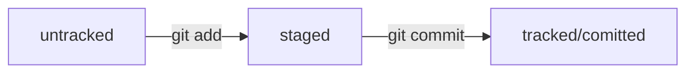

# Популярные команды для консоли
## Навигация

- `pwd` (от англ. print working directory, «показать рабочую папку») — покажи, в какой я папке
- `ls` (от англ. list directory contents, «отобразить содержимое директории») — покажи файлы и папки в текущей папке
- `ls -a` — покажи также скрытые файлы и папки, названия которых начинаются с символа
- `cd first-project` (от англ. change directory, «сменить директорию») — перейди в папку first-project
- `cd first-project/html` — перейди в папку html, которая находится в папке first-project
- `cd ..` — перейди на уровень выше, в родительскую папку
- `cd ~` — перейди в домашнюю директорию (/Users/Username)
- `cd /` — перейди в корневую директорию

## Работа с файлами и папками
### Создание

- `touch index.html` (англ. touch, «коснуться») — создай файл index.html в текущей папке;
- `touch index.html style.css script.js` — если нужно создать сразу несколько файлов, можно напечатать их имена в одну строку через пробел;
mkdir second-project (от англ. make directory, «создать директорию») — создай папку с именем second-project в текущей папке.
- `take` - создание новой директории и сразу же заход в нее

## Копирование и перемещение
- `cp file.txt ~/my-dir` (от англ. copy, «копировать») — скопируй файл в другое место;
- `mv file.txt ~/my-dir` (от англ. move, «переместить») — перемести файл или папку в другое место.
Чтение
- `cat file.txt` (от англ. concatenate and print, «объединить и распечатать») — распечатай содержимое текстового файла file.txt.

### Удаление
- `rm about.html` (от англ. remove, «удалить») — удали файл about.html;
- `rmdir images` (от англ. remove directory, «удалить директорию») — удали папку images;
- `rm -r second-project` (от англ. remove, «удалить» + recursive, «рекурсивный») — удали папку second-project и всё, что она содержит.

# Основные команды при работе с git
- `git init` – cделать папку репозиторием
- `rm -rf .git` - «разгитить» папку, если что-то пошло не так
- `git status` – проверить состояние репозитори
- `git add` / `git add --all` – подготовка файлов к коммиту
- `git commit -m "текст коммита"` - сделать коммит с ключом -m (от англ. message — «сообщение»), который присваивает коммиту сообщение.
- `git log` - посмотреть историю коммитов
- `git log --oneline` - посмотреть историю коммитов без лишней табуляции
- `git remote add origin` + SSH - привязать удалённый репозиторий к локальному
- `git push -u origin main` - когда первый раз отправляешь изменения на удалённый репозиторий. Флаг -u свяжет локальную ветку с одноимённой удалённой.
- `git push` - отправить изменения на удалённый репозиторий 
- `git commit --amend` - внести правки в последний коммит (`HEAD`) вручную
- `git commit --amend --no-edit` - дополнить коммит новыми файлами
- `git commit --amend -m "Новое сообщение"` - изменить сообщение коммита
- `git restore --staged <file>` - (от англ. restore — «восстановить») убрать файл из списка "готовы к коммиту"
- `git restore --staged .` - «сбросить» все файлы из `staged` обратно в `untracked`/`modified`
- `git reset --hard <commit hash>` - «откатиться» до определенного коммита. Более поздние коммиты потеряются
- `git restore <file>` - «откатить» изменения, которые не попали ни в staging, ни в коммит

# Что такое Hash?
Хеширование (от англ. hash, «рубить», «крошить», «мешанина») — это способ преобразовать набор данных и получить их «отпечаток» (англ. fingerprint).

Информация о коммите — это набор данных: когда был сделан коммит, содержимое файлов в репозитории на момент коммита и ссылка на предыдущий, или родительский (англ. parent), коммит.

Git хеширует (преобразует) информацию о коммите с помощью алгоритма SHA-1 (от англ. Secure Hash Algorithm — «безопасный алгоритм хеширования») и получает для каждого коммита свой уникальный хеш — результат хеширования.

Git хранит таблицу соответствий хеш → информация о коммите. Если вы знаете хеш, вы можете узнать всё остальное: автора и дату коммита и содержимое закоммиченных файлов. Можно сказать, что хеш — основной идентификатор коммита.

# Файл HEAD
Файл `HEAD` (англ. «голова», «головной») — один из служебных файлов папки `.git`. Он указывает на коммит, который сделан последним (то есть на самый новый).

Когда вы делаете коммит, Git обновляет refs/heads/master — записывает в него хеш последнего коммита. Получается, что `HEAD` тоже обновляется, так как ссылается на refs/heads/master.

Если нужно передать последний коммит, то вместо его хеша можно просто написать слово `HEAD` — Git поймёт, что вы имели в виду последний коммит.

# Отслеживание файлов

## Статусы:
- `untracked`/`tracked` (англ. «неотслеживаемый»)
- `staged` (англ. «подготовленный»)
- `modified` (англ. «изменённый»)

## Типичный жизненный цикл файла в Git
1. Файл только что создали. Git ещё не отслеживает содержимое этого файла. Состояние: `untracked`.
2. Файл добавили в staging area с помощью `git add`. Состояние: `staged` (+ `tracked`). 
    - Возможно, изменили файл ещё раз. Состояния: `staged`, `modified` (+ `tracked`). 
    Обратите внимание: `staged` и `modified` у одного файла, но у разных его версий.
    - Ещё раз выполнили `git add`. Состояние: `staged` (+ `tracked`).
3. Сделали коммит с помощью `git commit`. Состояние: `tracked`.
4. Изменили файл. Состояние: `modified` (+ `tracked`).
5. Снова добавили в staging area с помощью `git add`. Состояния: `staged` (+ `tracked`).
6. Сделали коммит. Состояния: `tracked`.

